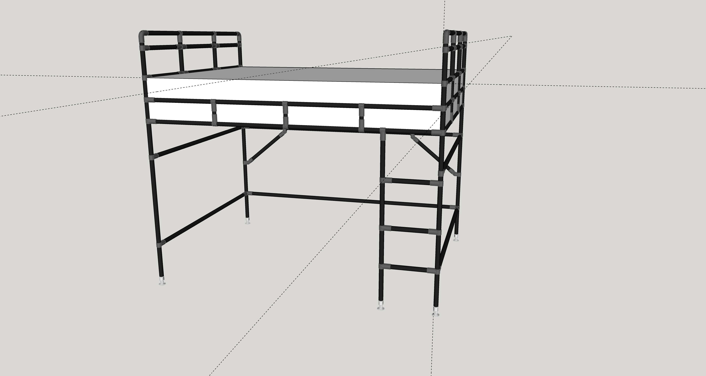

# Lofted Bedframe

This bedframe is built using FlexPipe, and will add a few feet of storage underneath a queen sized bed.

It is designed using SketchUp and the [FlexPipe Creator](https://www.flexpipeinc.com/us_en/creator-extension/) plugin to generate the actual frame and cut list.

